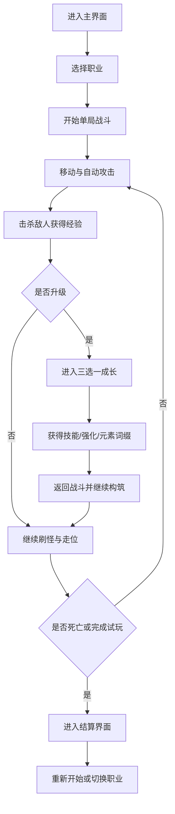

## 1. 产品概述
这是一款俯视角像素风肉鸽动作试玩 Demo，玩家在单局战斗中选择角色、叠加技能并附加元素伤害，体验不同流派的构筑差异。
- 核心目标是验证“职业差异 + 技能联动 + 元素反应 + 一局成长”的玩法闭环，面向喜欢《咒语旅团》式爽快战斗与构筑反馈的玩家。
- 试玩版强调短时上手、重复可玩和战斗辨识度，为后续扩展更多角色、地图、敌人和遗物系统提供方向。

## 2. 核心功能

### 2.1 用户角色
本 Demo 仅包含玩家单机体验，不区分平台用户角色。

### 2.2 功能模块
1. **主界面**：标题展示、职业选择、开始试玩、核心玩法说明
2. **战斗界面**：角色移动、自动攻击、技能释放、敌人刷新、伤害结算、元素表现
3. **成长选择界面**：升级后选择技能、强化已有技能、叠加元素词缀、构筑当前流派
4. **结算界面**：存活时长、击杀数、构筑摘要、重新开始

### 2.3 页面详情
| 页面名称 | 模块名称 | 功能说明 |
|-----------|-------------|---------------------|
| 主界面 | 职业卡片 | 展示近战、远程、法师三种原型的攻击方式、基础属性和推荐流派 |
| 主界面 | 试玩入口 | 开始游戏、查看操作说明、了解本次 Demo 目标 |
| 战斗界面 | 玩家控制 | WASD 移动，角色自动朝最近敌人攻击，支持主动技能冷却释放 |
| 战斗界面 | 敌人与波次 | 持续生成近战追击敌人与远程干扰敌人，按时间提高压力 |
| 战斗界面 | HUD | 展示生命值、经验值、等级、当前技能、元素词缀和冷却信息 |
| 战斗界面 | 元素伤害 | 火、冰、雷三种元素可附着在技能或攻击上，触发燃烧、冰缓、连锁电弧 |
| 成长选择界面 | 三选一升级 | 玩家升级时暂停战斗，从 3 个强化项中选择 1 个 |
| 成长选择界面 | 组合构筑 | 支持选择新技能、提升技能等级、添加元素附魔、强化暴击或范围 |
| 结算界面 | 战斗总结 | 展示本局职业、技能组合、元素流派、最高秒伤与击杀数据 |

## 3. 核心流程
玩家进入主界面后选择职业并开始战斗，在单张地图上移动与清怪，通过击杀敌人获取经验升级。每次升级从三项成长中选择其一，逐步形成近战爆发、远程弹幕或法术元素等不同构筑。玩家在敌人压力持续提升下尽量存活更久，最终在死亡或通关试玩时进入结算界面并重新挑战。

## 4. 用户界面设计
### 4.1 设计风格
- 主色调：深紫黑夜背景、青蓝魔能高光、橙红火焰点缀、金黄拾取反馈
- 按钮风格：像素描边按钮，悬停时带发光与轻微位移反馈
- 字体与字号：标题使用像素风展示字体，正文使用清晰易读的复古无衬线字体；数值和伤害文本偏紧凑
- 布局风格：桌面优先，主界面采用大幅标题与职业卡片并列布局，战斗界面以全屏地图配 HUD 浮层
- 图标建议：使用像素风技能图标、元素符号、职业徽记与伤害弹字

### 4.2 页面设计概览
| 页面名称 | 模块名称 | UI 元素 |
|-----------|-------------|-------------|
| 主界面 | 标题区域 | 大尺寸像素标题、动态星屑背景、试玩定位文案、开始按钮 |
| 主界面 | 职业卡片 | 像素头像、武器图标、基础属性条、职业描述、推荐技能路线 |
| 战斗界面 | 地图场景 | 深色像素地砖、草地和遗迹装饰、敌人阴影、投射物拖尾、掉落光点 |
| 战斗界面 | HUD | 血条、经验条、技能栏、元素栏、升级提示、伤害数字与状态标识 |
| 成长选择界面 | 选择弹窗 | 三张强化卡片、颜色区分稀有度、图标预览、组合说明、键盘快速选择 |
| 结算界面 | 总结面板 | 本局构筑列表、职业立绘、战斗数据、再来一局按钮 |

### 4.3 响应式
采用桌面优先设计，保证 PC 键盘操作体验；同时保留基础自适应能力，使界面在较小窗口下仍可浏览主界面和结算信息。试玩阶段不重点优化触屏操作，但保留后续添加虚拟摇杆的结构空间。
