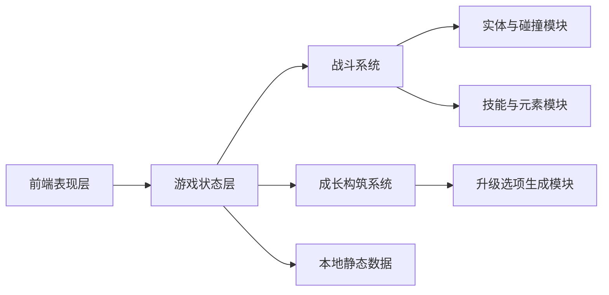
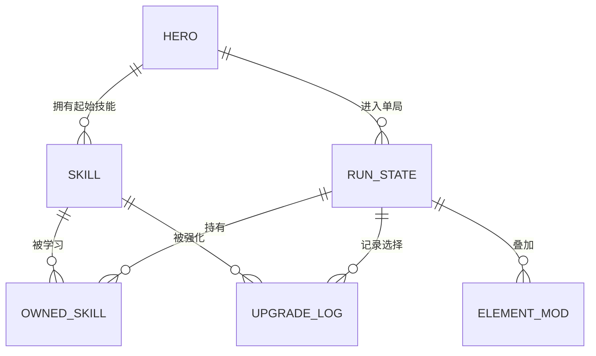

## 1. 架构设计


## 2. 技术描述
- 前端：React@18 + TypeScript + Vite
- 样式：Tailwind CSS@3 + 少量自定义像素风 CSS 动画
- 游戏渲染：HTML5 Canvas
- 状态管理：React Context + `useReducer`
- 初始化工具：Vite
- 后端：无，试玩版全部使用本地数据与前端逻辑
- 数据：静态 JSON/TS 配置，包含职业、技能、敌人、元素与升级池

## 3. 路由定义
| 路由 | 用途 |
|-------|---------|
| / | 主界面，展示职业选择与试玩说明 |
| /run | 单局战斗界面，承载地图、HUD、成长选择和结算切换 |

## 4. 核心模块定义
### 4.1 数据类型
```ts
type HeroClass = "warrior" | "ranger" | "mage";
type ElementType = "physical" | "fire" | "ice" | "lightning";

interface HeroDefinition {
  id: HeroClass;
  name: string;
  baseHp: number;
  moveSpeed: number;
  attackInterval: number;
  starterSkillId: string;
  tags: string[];
}

interface SkillDefinition {
  id: string;
  name: string;
  category: "active" | "passive" | "auto";
  element: ElementType;
  levelScaling: number[];
  description: string;
}

interface UpgradeOption {
  id: string;
  kind: "new-skill" | "skill-up" | "element-mod" | "stat-mod";
  targetId?: string;
  rarity: "common" | "rare" | "epic";
  description: string;
}
```

### 4.2 系统职责
- `GameShell`：统一管理场景切换、暂停、开始、结束和局内弹层
- `CanvasArena`：负责地图绘制、玩家与敌人更新、命中检测和视觉反馈
- `CombatEngine`：处理自动攻击、技能冷却、投射物、AOE 和伤害计算
- `BuildSystem`：维护技能列表、升级结果、元素词缀、被动叠层和流派摘要
- `SpawnerSystem`：按时间曲线生成敌人，并提升速度、血量和数量压力
- `ProgressionSystem`：处理经验获取、等级成长和三选一升级逻辑

## 5. 数据流说明
玩家在主界面选择职业后，将职业配置写入全局状态并进入战斗路由。战斗循环按固定时间步更新角色、敌人、投射物和伤害事件，再将结果同步到 HUD。经验达到阈值后暂停战斗，读取升级池并生成三项候选，玩家选择后更新构筑状态与技能配置，再恢复循环。结算时汇总本局构筑和统计信息返回展示层。

## 6. 数据模型
### 6.1 数据关系


### 6.2 数据定义策略
- 职业、技能、敌人、升级选项全部保存在 `src/data` 下的静态配置文件中，方便后续扩展数值
- 局内状态只保存在内存，不做持久化，确保试玩版逻辑简单可控
- 元素效果采用统一枚举与处理器模式，便于不同技能复用同一套燃烧、冰缓、感电逻辑

## 7. 实现约束
- 采用桌面优先和键盘操作优先，不引入账号系统、联网同步或复杂存档
- 试玩目标控制在 10 分钟内完成一局，地图与敌人类型保持精简但反馈清晰
- 首版优先确保战斗手感、构筑差异和性能稳定，再考虑音效、屏幕震动和更多特效
